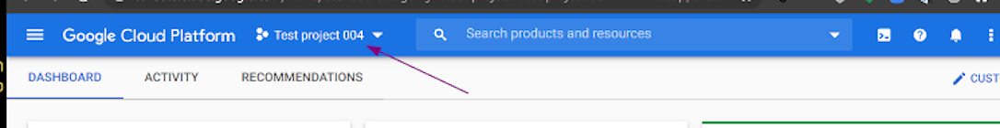
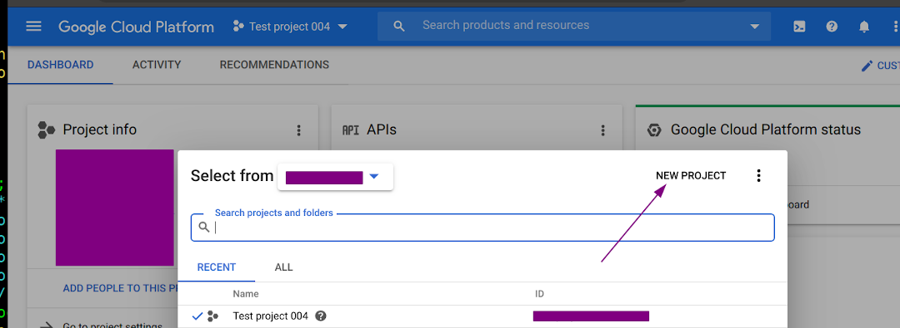
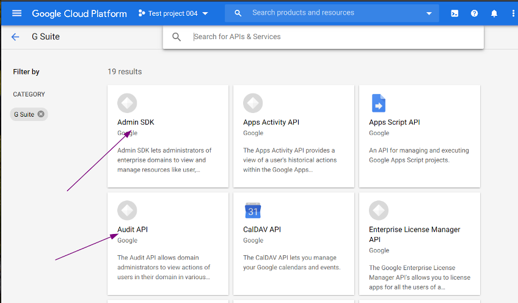
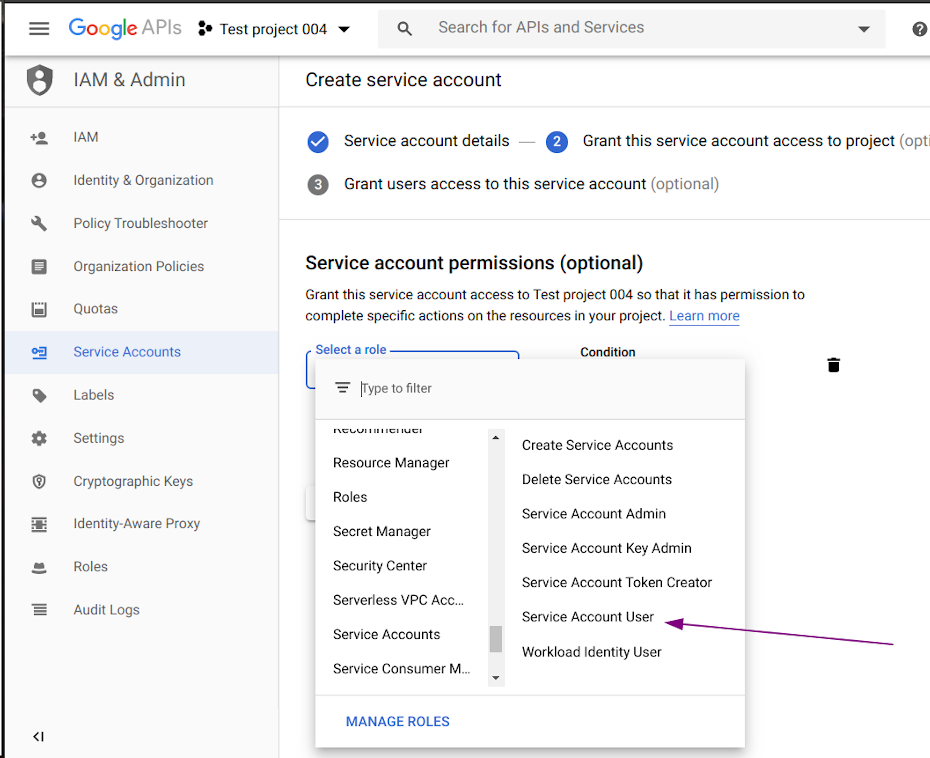
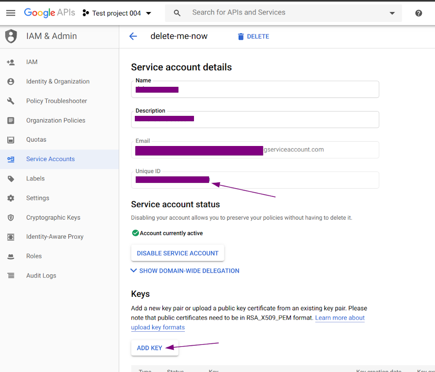
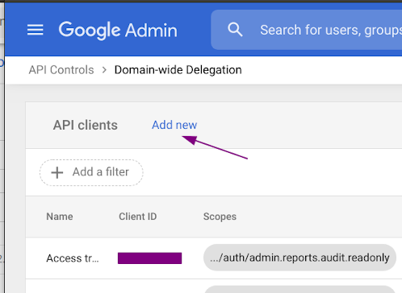
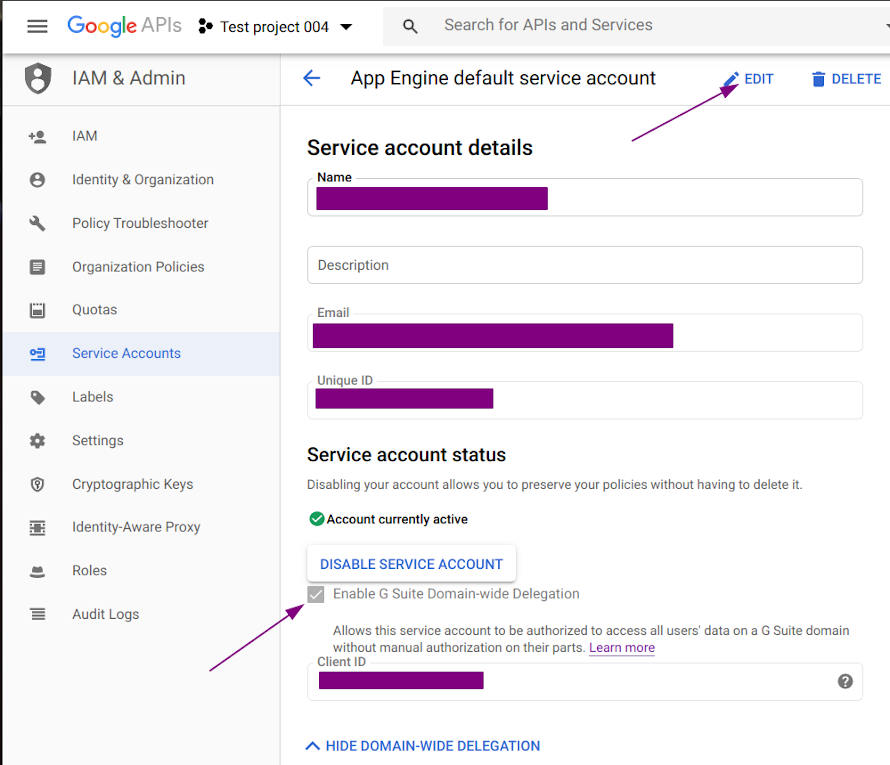

G Suite API / Service account creation

# How to set up the admin reports API access for G Suite

We will need to set up a service account for API access and the G Suite account access information collection.
As per the Principle of least privilege, the account will only have access to the account access reports via the G Suite Admin API.
Service accounts require a project and an owner. The project is as a placeholder for the account and will be granted audit API services. The owner will authorize the access privileges.
_*The user must have the proper authority to create and grant a service account and domain-wide delegation. Currently this is only a "[Super Admin](https://support.google.com/a/answer/2405986)".*_

1. Create the project or use an existing project
2. Enable Admin SDK and Audit API services for the project
3. Add a service account credentials for the project
4. Grant the service account a domain wide delegation
5. References - the LONG version

---

### 1. [Create a new project](https://console.developers.google.com/)
_Skip to #2 if using an existing project_

  
  

From the developers console, select the drop down list at the top of the page.  

- Select "NEW PROJECT"
- Enter an appropriate project name.
- Verify the organization.  This is the domain we will be polling data for.
- Verify the location.  Usually this is the same as the organization.
- Select "CREATE"

### 2. Add Admin SDK and Audit API to the project

Go to the development [console API dashboard](https://console.developers.google.com/apis/dashboard).  

- Select the project to use for this service account.
- Select "+ ENABLE APIS AND SERVICES" at the top of the right pane, "APIs & Services"
- Select "G Suite" from the list in the left pane

  

- Select the "Audit API" box from the right pane
- Select the "ENABLE" button
- Return to the "G Suite" selection page, select "<---"
- Select the "Admin SDK" box
- Select the "ENABLE" button

### 3. Add credentials to your project

Go to the development [console API dashboard](https://console.developers.google.com/apis/dashboard).  

- Select the project from the drop down list at the top of the page
- From the left pane, select "Credentials"
- Select "+ CREATE CREDENTIALS" at the top of the right pane
- Select "Service account" from the drop down list
- Enter an appropriate service account name
- Make note of the service account ID for later reference
- Enter an appropriate service account description
- Select the "CREATE" button

  

- From the drop down list, "Select a role", select the "Service Accounts" -> "Service Account User" role
- Select the "CONTINUE" button
- "Grant users access to this service account (optional)", Select "DONE"
- Select the newly created service account from the "Service Accounts" list

  

- Note the "Unique ID" for later reference
- Select "ADD KEY"
- Select "Create new key"
- Verify the key type selected is "JSON"
- Select "CREATE"
- Secure the key file and forward it to the requesting party
_*The key file needs to be kept secure and available to the collection agent for use.*_
- Select "CLOSE"

Make sure to secure and forward the downloaded JSON key to the requesting person or service.

### 4. Delegate domain-wide authority for the service account

Log into the G Suite [Administration Console](http://admin.google.com/) with a privileged account.  

- Select "Security" section from the main pane
- Select "API Permissions"
- Select the "MANAGE DOMAIN WIDE DELEGATION"
- Select "Add new" next to "API clients"
- For "Client ID", enter the client name. This is the unique ID from step #3.
- Add the admin reports audit scope to the "OAuth scopes (comma-delimited)" dialog
    > https://www.googleapis.com/auth/admin.reports.audit.readonly
- Select the "Authorize" button.

  

Enable the Domain-wide Delegation for the service account
Return to the ["IAM & Admin" page](https://console.cloud.google.com/iam-admin/)  

- Select "[Service Accounts](https://console.cloud.google.com/iam-admin/serviceaccounts/)"
- Select the Email for this service account

  

- Select "Edit"
- Select "SHOW DOMAIN-WIDE DELEGATION"
- Check the box next to "Enable G Suite Domain-wide Delegation"
- Select "SAVE"

### 5. References

The list of resources used.  

- [Cloud Identity and Access Management (IAM)](https://cloud.google.com/iam)
- [Service accounts](https://cloud.google.com/iam/docs/service-accounts)
- [Reports API: Prerequisites](https://developers.google.com/admin-sdk/reports/v1/guides/prerequisites)
- [Control which third-party & internal apps access G Suite data](https://support.google.com/a/answer/7281227)
- [Authorize Requests](https://developers.google.com/admin-sdk/reports/v1/guides/authorizing)
- [G Suite Domain-wide Delegation](https://developers.google.com/admin-sdk/reports/v1/guides/delegation)
